# F1 Extension Architecture

## Overview

**F1** is a comprehensive productivity extension for Visual Studio Code that provides quick access to editor controls, dynamic shortcuts, and extension management. The extension enhances developer workflow by offering instant toggles for common settings and customizable keyboard shortcuts, all accessible through an intuitive activity bar interface.

## How it Works

When a user activates the **F1** extension in VS Code:

1. The `package.json` file registers commands, keybindings, and views through the `contributes` field.
2. The main `extension.ts` orchestrates activation of various subsystems including webview providers, shortcut managers, and configuration handlers.
3. Based on user interactions, the **Shortcut Engine** executes custom commands and toggles editor configurations.
4. The **Webview System** provides interactive panels for managing shortcuts, editor controls, and extensions.
5. Supporting modules handle dynamic shortcut persistence, UI state management, and cross-platform compatibility.

> 💡 **Note on keybinding conventions:**
> F1 is reserved for built-in functionality (markdown word wrap toggle). F2-F12 combinations support dynamic shortcuts with modifiers: `ctrl+f2-f12`, `shift+f2-f12`, `ctrl+shift+f2-f12`.

---

## Architecture Diagram

```mermaid
graph TB
    subgraph "📦 F1 Extension"
        direction TB
        A[package.json<br/>📋 Main Configuration]

        subgraph "🔧 Core Systems"
            direction LR
            B[Commands & Keybindings<br/>⌨️ User Interactions]
            C[Views & Webviews<br/>🖥️ UI Panels]
            D[Configuration<br/>⚙️ Settings Management]
        end

        subgraph "⚡ Shortcut Engine"
            direction TB
            E[Dynamic Shortcuts<br/>🎯 F2-F12 System]
            F[Static Shortcuts<br/>🔧 Built-in Toggles]
            G[Shortcut Persistence<br/>💾 Storage Layer]

            subgraph "🎯 Shortcut Types"
                direction LR
                H[Editor Controls<br/>📝 VS Code Settings]
                I[Extension Commands<br/>🔌 VS Code Commands]
                J[Custom Actions<br/>⚡ User Defined]
            end
        end

        subgraph "🖥️ Webview System"
            direction TB
            K[F1 Shortcuts Panel<br/>📋 Main Interface]
            L[Editor Controls Panel<br/>🎛️ Settings UI]
            M[Extensions Panel<br/>🔌 Extension Manager]

            subgraph "📦 Panel Features"
                direction LR
                N[Shortcut Creator<br/>➕ Add Shortcuts]
                O[Shortcut Manager<br/>✏️ Edit/Delete]
                P[Usage Analytics<br/>📊 Statistics]
            end
        end

        subgraph "📚 Core Modules"
            direction LR
            Q[extension.ts<br/>🎯 Main Orchestrator]
            R[DynamicShortcutManager<br/>🔄 Runtime Manager]
            S[MyListUI<br/>📝 UI State Handler]
            T[Configuration Toggles<br/>🔄 Settings Engine]
        end
    end

    subgraph "🎯 VS Code Integration Layer"
        direction TB
        U[VS Code Extension Host<br/>🏠 Runtime Environment]

        subgraph "⚙️ Core Services"
            direction LR
            V[Command System<br/>🎮 Command Execution]
            W[Configuration API<br/>⚙️ Settings Access]
            X[Webview API<br/>🖼️ UI Rendering]
            Y[Storage API<br/>💾 Data Persistence]
        end

        Z[User Interface<br/>👤 Developer Experience]
    end

    %% Main connections
    A --> B
    A --> C
    A --> D
    B --> E
    B --> F
    E --> G
    G --> H
    G --> I
    G --> J
    C --> K
    C --> L
    C --> M
    K --> N
    K --> O
    K --> P
    Q --> R
    Q --> S
    Q --> T

    %% Integration connections
    A -.-> U
    E -.-> V
    F -.-> V
    H -.-> W
    I -.-> V
    K -.-> X
    L -.-> X
    M -.-> X
    G -.-> Y
    R -.-> Y
    S -.-> Y
    T -.-> W

    %% Styling
    classDef mainConfig fill:#ff6b6b,stroke:#333,stroke-width:2px,color:#fff
    classDef coreSystems fill:#4ecdc4,stroke:#333,stroke-width:2px,color:#fff
    classDef shortcutEngine fill:#45b7d1,stroke:#333,stroke-width:2px,color:#fff
    classDef webviewSystem fill:#96ceb4,stroke:#333,stroke-width:2px,color:#fff
    classDef coreModules fill:#a8e6cf,stroke:#333,stroke-width:2px,color:#000
    classDef services fill:#feca57,stroke:#333,stroke-width:2px,color:#000
    classDef ui fill:#ff9ff3,stroke:#333,stroke-width:2px,color:#000

    class A mainConfig
    class B,C,D coreSystems
    class E,F,G,H,I,J shortcutEngine
    class K,L,M,N,O,P webviewSystem
    class Q,R,S,T coreModules
    class V,W,X,Y services
    class Z ui
```



## Core Components

### 1. Main Entry Point (`extension.ts`)
The central orchestrator that:
- Initializes all subsystems
- Registers commands and webview providers
- Manages the dynamic shortcut system
- Handles configuration toggling logic

### 2. Shortcut Engine
**Dynamic Shortcuts System:**
- Supports F2-F12 key combinations with modifiers
- Persistent storage using VS Code's global state
- Runtime execution of custom command sequences

**Static Shortcuts:**
- F1: Toggle markdown word wrap
- Shift+F1: Toggle AI suggestions
- Immediate execution without storage

### 3. Webview System
**Three Main Panels:**
- **Shortcuts Panel**: Create, manage, and execute custom shortcuts
- **Editor Controls Panel**: Toggle VS Code editor settings
- **Extensions Panel**: Manage installed extensions

**Features:**
- Real-time UI updates
- Usage statistics and analytics
- Drag-and-drop shortcut organization

### 4. Configuration Management
**Toggle System:**
- Handles boolean, enum, and string configuration values
- Provides user feedback for state changes
- Supports complex configuration mappings

**Supported Settings:**
- Editor features (minimap, line numbers, folding, etc.)
- UI elements (breadcrumbs, status bar, side bar, etc.)
- Development tools (intelliSense, hover, parameter hints, etc.)

## Data Flow

1. **User Interaction** → Keybinding/Command triggers
2. **Command Routing** → Extension host receives command
3. **Execution Logic** → DynamicShortcutManager or direct toggle
4. **Configuration Update** → VS Code settings API
5. **UI Feedback** → Status messages and webview updates
6. **Persistence** → Global state storage for user shortcuts

## File Structure

```
src/
├── extension.ts                 # Main entry point
├── core/
│   └── performance-shortcut.ts  # Performance utilities
├── disable-enable/
│   ├── editor-controls/
│   │   ├── ed-controls.ts       # Editor controls activation
│   │   └── ed-icons.ts          # UI icons
│   ├── extensions/
│   │   └── editor-extensions.ts # Extensions panel
│   └── shortcuts/
│       ├── ui.ts                # Webview provider
│       ├── create-shortcut/
│       │   ├── btn-shortcut.ts  # Shortcut creation UI
│       │   ├── ed-content.ts    # Content editor
│       │   └── ex-content.ts    # Content extraction
│       └── my-list/
│           ├── dynamic-shortcuts.ts # Dynamic shortcut manager
│           ├── user-shortcuts.ts    # User shortcut UI
│           └── default/
│               ├── ai.ts        # AI shortcuts
│               └── f1.ts        # F1 shortcuts
└── __test__/
    └── extension.test.ts        # Test suite
```

## Key Design Patterns

### Singleton Pattern
- `DynamicShortcutManager` uses singleton for centralized shortcut management
- Ensures consistent state across webview instances

### Provider Pattern
- `F1WebviewProvider` implements VS Code's webview provider interface
- Handles UI lifecycle and message passing

### Command Pattern
- All user actions abstracted as executable commands
- Supports undo/redo through VS Code's command system

### Observer Pattern
- Webview panels observe shortcut manager state changes
- Automatic UI updates when shortcuts are modified

## Performance Considerations

- **Lazy Loading**: Modules activated only when needed
- **Efficient Storage**: Minimal data persistence with VS Code's global state
- **UI Optimization**: Webviews use virtual scrolling for large shortcut lists
- **Memory Management**: Proper disposal of resources and event listeners

## Extensibility

The architecture supports easy addition of:
- New shortcut types and categories
- Additional webview panels
- Custom configuration toggles
- Third-party command integration
- New keybinding schemes

## Testing Strategy

- **Unit Tests**: Core logic in `extension.test.ts`
- **Integration Tests**: Webview interactions and command execution
- **E2E Tests**: Full user workflows and keybinding sequences
- **Performance Tests**: Memory usage and execution speed benchmarks

## Future Enhancements

- **Cloud Sync**: Cross-device shortcut synchronization
- **Team Templates**: Shared shortcut collections
- **Advanced Analytics**: Usage patterns and optimization suggestions
- **Plugin System**: Third-party shortcut providers
- **Gesture Support**: Touch and gesture-based shortcuts</content>
<parameter name="filePath">/home/bastndev/Documents/bastndev/VScode/F1/ARCHITECTURE.md
